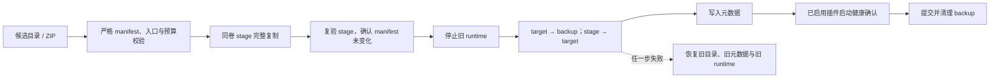

# ADR-0002：插件生命周期与目录事务

- 状态：已接受
- 日期：2026-08-09
- 里程碑：M2.1

## 背景

旧实现会在并发启用时启动多个子进程；启动超时只拒绝 Promise 而不回收进程；意外退出后 Manager 仍保留失效引用。升级流程还会先删除旧目录，再复制新目录和更新数据库，任何一步失败都可能使插件无法启动或丢失原版本。

本 ADR 只解决生命周期、目录/元数据一致性和首窗可用性。插件 renderer 隔离属于 M2.2；backend 的强制能力边界属于 M2.3。当前子进程不能被描述为“不可信代码安全沙箱”。

## 决策

### 生命周期协调

- 每个插件的激活、停止和用户停用分别使用 single-flight Promise；并发或事件回调重入只复用同一操作。
- sandbox 在 `start()` 前即登记到 Manager，启动失败、超时或取消都必须终止子进程并等待真实 `exit/close`。
- 正常停止标记为 expected，状态为 `Deactivating → Inactive`；意外退出清理引用、快捷键和订阅，并进入 `Error`，随后允许显式重启。
- 已启用插件并行恢复。首窗创建后再后台恢复插件，单个插件的 30 秒超时不能阻塞应用界面。
- 升级维护期间，新的启用、停用、配置写入和卸载请求 fail closed；若停用已先开始，升级必须等待它完成并重新读取最终 enabled 状态。

### 安装与升级

- 所有入口统一经过 `PluginManifestPolicy`：256 KiB 清单上限、严格字段、完整 SemVer、已知且不重复的权限、规范化相对 JS 入口、普通文件与根目录 containment。
- 目录复制拒绝符号链接、特殊文件、超过 5,000 个条目或 600 MiB 的候选；stage、backup、target 必须是插件根目录的直接子项。
- 新安装遇到“有目录但无数据库记录”时拒绝覆盖，保留目录供人工恢复。
- 升级在旧 runtime 仍可用时完成 stage；只有 stage 完整复验后才停旧版本。
- 文件系统交换与数据库无法组成同一个 ACID 事务，因此采用补偿事务：backup 在新版本健康启动前始终保留。失败时先停新 runtime，再恢复目录和旧元数据，最后恢复旧 runtime。
- 禁用插件升级后仍保持禁用。新安装由 IPC 在事务提交后首次启用；若首次激活失败，走事务化卸载。
- 事务提交后的 backup/stage 清理失败只留下可恢复垃圾，不得把已经成功的安装报告成失败，也不得反向覆盖健康 target。

### 卸载

- 先停止 runtime，再把 target 原子改名到同卷 quarantine。
- 数据库删除失败时，将 quarantine 原位恢复；插件原先启用则恢复 runtime。
- 数据库删除成功后提交清理。清理失败时元数据已删除，但代码仍保留在隐藏 quarantine，启动恢复器可继续完成清理。

### 崩溃恢复

- 交换前写入宿主保留的事务 journal；候选不得自带该文件。
- Manager 初始化时只扫描符合严格命名规则的直接子目录，不跟随符号链接。
- 未提交升级保留 journal：恢复 backup、旧 manifest 元数据并移除候选。
- 已提交 journal 与 backup 同时存在：核对宿主元数据仍指向新版本后，只继续清理 backup 和 marker。
- 无 journal 的 backup 与现存 target 同时出现属于歧义状态：两份内容都保留并阻止插件激活，等待人工恢复，绝不猜测哪一份应被删除。
- 卸载 quarantine 与数据库记录同时存在时恢复目录；记录已不存在时继续清理 quarantine。
- 恢复动作必须幂等。清理失败可以留待下次启动，但不得撤销已经完成的恢复。

## 数据兼容性

- 升级不修改 `config_data`，已有配置和插件自建数据表保持原样。
- 回滚恢复原插件版本、入口、权限和 config schema；enabled 状态以用户最后完成的停用/启用操作为准。
- 本里程碑不执行用户数据迁移，也不删除孤儿目录。
- 原子域只覆盖插件代码目录、manifest、宿主插件元数据和宿主管理的配置。插件若在 `activate()` 内直接修改自建表或任意文件，这些副作用无法由目录事务回滚；M2.3 SDK v2 将禁止隐式启动迁移，改用显式、版本化且可备份/回滚的 migration 生命周期。
- 当前 journal 提供进程崩溃恢复；断电级持久性仍取决于操作系统与文件系统对目录项的落盘语义，本 ADR 不宣称跨文件系统与 SQLite 的断电 ACID 事务。

## 验证要求

- 单测覆盖并发/重入激活、启动超时回收、正常停止、崩溃重启和停用竞态。
- 文件事务测试覆盖 install/upgrade/uninstall 的成功、数据库失败、启动失败、孤儿目录、并发安装、停用与升级并发、符号链接和预算边界。
- 崩溃恢复测试覆盖每个 rename/元数据写入窗口，并验证重复恢复安全。
- 里程碑结束必须通过格式检查、ESLint、Node/renderer/test/plugin 类型检查、全部 Vitest、生产构建、unpacked 打包与 packaged smoke。

## 后续

- M2.2 将 renderer 移入独立跨源 iframe，并删除父页面执行插件字符串及 `'unsafe-eval'`。
- M2.3 将 backend transport 迁到 `utilityProcess` 以获得故障隔离和可观测性；它不是安全沙箱。不可信 backend 必须使用 OS 边界，或取消任意 Node 执行。
- UniEnv 将拆成普通编排插件与宿主持有的受信安装服务，通用第三方插件不会获得粗粒度 `child_process` 能力。
