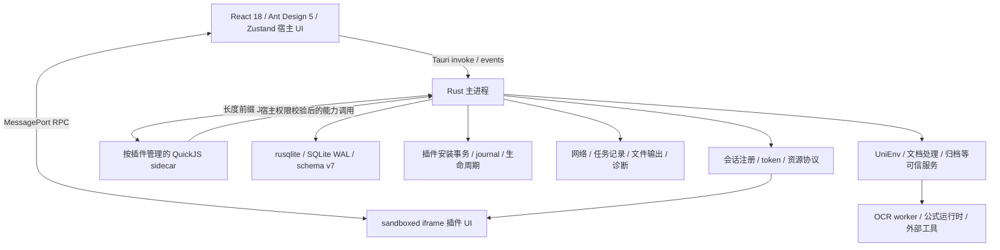
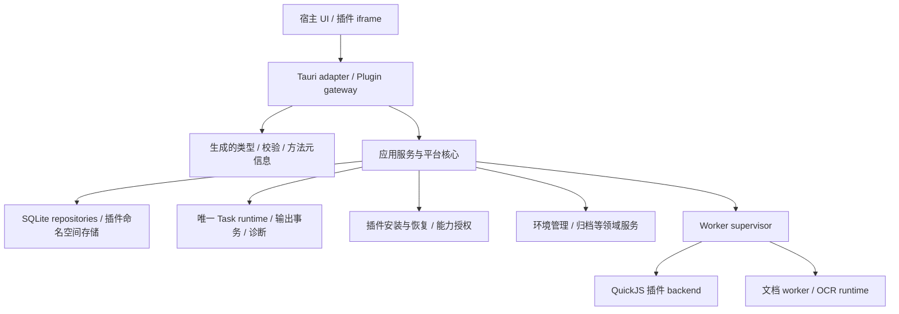

# CrucibleBox 架构评估与并行优化方案

> 本文是 2026-10-02 工作区静态评估与原始待实施设计，不代表当前状态。2026-10-09 更新：Next beta.1 Manifest/API 5、wire 3、data 1 已冻结，七个官方插件已集成自包含 SDK/CLI；PDFium/Document IR 已移入独立按需 worker，repository 与任务恢复边界已收敛。当前证据见 docs/architecture.md、docs/document-engine-status.md 与 E:\OCR\next-architecture-gaps-completion-20261009.md。仍待当前目标 MSVC 全量门禁与发布 profile 验收；这不代表 beta.3 全计划或 OCR 精度门禁完成。允许不兼容旧插件不等于允许丢失用户数据。

## 当前执行范围

新架构官方目录固定为七个插件：`document-engine`（文档与知识库）、`theme-manager`（主题管理）、`unienv`（开发环境管理）、`diary`（日记与笔记）、`turntable`（随机决策，含骰子）、`gif-editor`（GIF 动画编辑）、`archive-extractor`（压缩与解压缩）。机器来源为 `contracts/next/official-plugins.json`，生成包装清单为 `scripts/next-plugin-catalog.json`；旧 beta3 清单仍用于历史验收和数据保存，不冒充 Next 插件包。

退出 Next 官方范围不删除源代码、已安装包、配置、附件或数据库，不改变用户数据归属；所有旧数据仍列入迁移/保留与配对回滚审查。用户已解除插件协议迁移暂停，按 B/C/D/E 波次与每包精确白名单推进；缺少契约映射的子项仍不解锁。已授权这七个插件的纯 UI 适配，使用 beta3 现有主题与 CSS token，覆盖六个内置主题；不得借 UI 工作改权限、存储 key、manifest 或 backend。Sol 继续宿主核心、权限隔离、数据迁移机制和任务状态机。

## 1. 结论与证据范围

建议保留 Tauri、Rust、React、SQLite、iframe 和 QuickJS sidecar，重构为“小型平台核心 + 按领域分离的业务服务 + 按需安装的重型 worker”。先统一契约和任务语义，再做插件迁移与物理拆分。不要同时更换 UI 框架、数据库、JS 引擎与插件协议。

本次检查了主程序装配、IPC、插件会话、宿主权限分发、安装恢复、数据库、任务管理、文档/OCR 服务、SDK、前端状态、插件清单及 CI。分支为 `codex/beta8-download-workspace`，HEAD 为 `5e22173`，大量实现尚在已修改/未跟踪文件中。因此 HEAD 本身不能代表本次评估的工作区，也不能直接作为两条实施分支的完整基线。

没有运行性能基准、渗透测试或完整构建。下文把源码事实、推断风险和目标分开；历史验收通过不当作本次工作区重新验证通过。发布、OCR 与旧库证据以 `docs/history/2.1.0-beta.3-local-acceptance.md` 的最新记录为准。

## 2. 当前架构



这是一种带插件扩展和辅助进程的桌面模块化单体。主程序仍承载大量业务，不能因为有 sidecar 就称为微服务系统。

| 层            | 当前职责                                             | 关键源码                                                              |
| ------------- | ---------------------------------------------------- | --------------------------------------------------------------------- |
| 宿主前端      | 页面、插件管理、市场、主题、任务展示                 | `tauri-frontend/src/App.tsx`、`pages/`、`store/`                      |
| Tauri 适配    | IPC、窗口身份、命令参数、事件                        | `src-tauri/src/main.rs`、`commands.rs`                                |
| 插件 renderer | 自包含 bundle、会话握手、配置和主题同步              | `src/plugin-runtime/`、`plugin_session.rs`、`plugin_protocol.rs`      |
| 插件 backend  | 每插件进程槽位、启动合并、维护互斥、故障处理         | `backend_process.rs`、`cruciblebox-plugin-host/src/`                  |
| 宿主能力      | 按方法校验权限并分发数据库、网络、文件、可信服务调用 | `permissions.rs`、`envelope_host.rs`                                  |
| 数据与恢复    | settings、插件、storage、日志、任务、迁移、安装事务  | `db.rs`、`install.rs`、`journal.rs`、`transaction.rs`                 |
| 业务服务      | 文档解析/布局/分块/转换、环境安装、归档              | `document_*.rs`、`pdf_parser.rs`、`unienv_*.rs`、`archive_service.rs` |
| 发布          | 自包含插件包、摘要、可信策略、安装器、更新签名和 CI  | `scripts/`、`tauri.conf.json`、`.github/workflows/`                   |

### 2.1 文档与实际实现的差异

1. `docs/architecture.md` 仍以 2.0.1 为题，数据库章节与部分“待 1.9.2 落地”描述已落后于 Rust 安装实现和 v7 迁移。
2. 当前正式清单有 14 个插件，源码目录还保留非正式分发插件。不能按 `plugins/` 目录数量推断正式插件数量。
3. 正式插件已经混用 Manifest/API v2、v3、v4。例如 diary/developer-toolkit 为 v4，document-engine/unienv 为 v3，theme-manager 为 v2。`commands.rs` 将 renderer API >=3 映射到运行时编码 v2；它不是“四套独立 wire 协议”，也不是看到版本不同就能判定加载失败。
4. 根工程及部分插件使用 React 19、Ant Design 6 相关依赖，宿主前端仍为 React 18 / Ant Design 5。iframe 内独立 bundle 允许这种差异；代价是工具链、类型和 UI 规范维护复杂。
5. Windows 会话 URL 为 `http://cruciblebox-plugin.localhost/<token>/...`。`plugin_session.rs` 明确 origin 不含 path；`PluginHost.tsx` 启用 `allow-same-origin`。因此是宿主与插件的跨源隔离加 token 会话隔离，不能声称各插件因 token 路径不同就拥有独立浏览器 origin。握手仍检查 source、origin、token 和 port。

## 3. 优点与缺点

### 3.1 应保留的优点

- **平台能力集中在 Rust。** UI 和插件不需要 Node 集成，网络、权限和数据恢复有统一落点。
- **安装和生命周期已经重视失败恢复。** staging、journal、原子替换、启动恢复、启动 single-flight 与维护窗口是有价值的基础设施，拆分时要保留这些不变量。
- **后端有进程故障隔离。** QuickJS backend 不进入主进程；纯 renderer 插件可不启动后台。不能据此宣称恶意插件获得了 OS 沙箱约束。
- **具有实际的宿主侧权限检查。** `backend_process.rs` 在调用 `host_dispatch` 前检查方法与权限，可信服务另按服务名检查。新架构不能仅依赖前端或 SDK 类型。
- **已有公共能力雏形。** 网络策略、持久任务、输出事务、诊断、模型 worker、可信摘要均可渐进收敛，不必从零开始。
- **插件包自包含、供应链有验证链。** 这使插件能独立构建与交付；应改进构建工具复用，而非让插件重新依赖宿主源码相对路径。

### 3.2 主要问题及优先级

| 优先级 | 已观察到的事实                                                                                             | 影响与判断                                                                                       |
| ------ | ---------------------------------------------------------------------------------------------------------- | ------------------------------------------------------------------------------------------------ |
| P0     | 契约散布在 TS 类型/校验、Rust envelope、权限映射和 SDK；manifest 版本与 wire 版本混用命名                  | 改一个能力要同步多处，容易出现接受集合、错误与预算不一致；适合先建立生成契约和跨语言 fixture     |
| P0     | 插件调用 `db.query/db.execute` 经权限检查后进入宿主数据库连接                                              | 有数据库权限的插件耦合宿主 schema；权限校验存在，但不等于插件数据隔离。新 SDK 应停止暴露宿主 SQL |
| P0     | Windows 多插件共享协议 origin；当前 sandbox 带 `allow-same-origin`                                         | 浏览器存储与插件间隔离语义需要明确和实机验证；尚未证明存在可利用越权，不能直接标为已确认漏洞     |
| P1     | `document_engine_service.rs` 3979 行、`commands.rs` 2240 行、`backend_process.rs` 1918 行、`db.rs` 1606 行 | 物理总行数包含注释与测试，只是定位线索；真正问题是装配、业务、协议与持久化边界交织               |
| P1     | 文档任务、UniEnv 任务、市场活动/取消集合、host task 快照各有实现                                           | 重复维护状态、取消、结果和恢复；已有确认取消机制应统一保留，不应重新退回“点击即取消成功”         |
| P1     | `Arc<Mutex<Db>>` 外层锁与 `Db` 内部 `Mutex<Connection>` 并存，服务使用多个 `OnceLock`                      | 锁的职责与初始化顺序较难推理，服务隔离测试困难；是否是性能瓶颈需测量，不能由锁数量断言           |
| P1     | 文档/PDF 处理模块及 PDFium 仍在主 crate，OCR 部分已外置                                                    | 重型业务影响构建、包体与宿主故障域；仅拆成 crate 不能隔离原生崩溃                                |
| P1     | 宿主与插件重复维护 UI、构建器、SDK/DTO、目录元信息                                                         | 增加批量升级和版本漂移成本；现有 `cruciblebox-plugin-ui` 可以复用，不另造第三套 UI 库            |
| P2     | `Marketplace.tsx` 1008 行，前端 task store 既消费快照又提供持久 mutation                                   | 页面职责较多；任务真值写入入口需收敛。不能在未审调用方前直接删除 mutation                        |
| P2     | 文档仍混有冻结时代描述，root 中 sql.js 仍有恢复工具/测试消费者                                             | 文档不能直接当实现证据；也不能仅因 Electron 已移除就机械删除所有旧命名与依赖                     |

## 4. 目标架构与取舍



采用模块化单体作为默认结构，只在故障隔离或资源管理有明确收益时增加进程。避免所有工具都成为独立服务，也不引入容器、服务发现或远程消息队列。

### 4.1 模块与依赖方向

建议先在现有路径中分模块，再按已稳定边界提取以下单元；名称为目标示意，不是要求立刻移动全部目录。

```text
contracts/                         方法、DTO、错误、预算及能力元信息源
packages/cruciblebox-plugin-api/    生成类型 + 薄 SDK，不依赖 React 业务类型
packages/cruciblebox-plugin-ui/     可选 UI 原语，保留现有包演进
packages/plugin-build/             可安装的插件构建 CLI
src-tauri/src/                     Tauri 装配和适配层
src-tauri/crates/core/             生命周期、安装协调、应用用例与 ports
src-tauri/crates/platform/         SQLite、Windows 网络、文件和进程实现
src-tauri/crates/document/         Document IR 与纯处理算法
src-tauri/crates/protocol/         宿主与 sidecar 共用的 Rust 协议部分
src-tauri/cruciblebox-plugin-host/  QuickJS 进程入口
workers/document/                 后续承载 PDFium/解析等重型管线
ocr-worker/                       保留并接入统一监督
```

依赖约束：core 不依赖 Tauri/WebView；document 算法不依赖窗口/插件安装；适配层不能直接拼业务 SQL；插件只消费发布包和稳定协议；跨进程不能传 Rust 内部结构。用少量明确的 ports 注入存储、网络、时钟、任务及 emitter，避免给每个函数制造 trait。

### 4.2 契约与不兼容插件升级

- 建立唯一可机器读取的契约源，选择 JSON Schema + 方法元信息作为初始方案。Sol 先验证生成 Rust DTO、TS 类型/运行时校验和权限映射的最小闭环；生成器选择不交给 Luna 猜测。
- 分开 `manifestVersion`、`sdkApiVersion`、`wireVersion` 与 `dataSchemaVersion`。新契约暂称 Next，正式编号由 Sol 核对已占用版本后冻结，不能把现有 v4 当空白版本复用。
- wire 保持有界 JSON/MessagePort 与长度前缀管道，先不引入 protobuf；统一结构化错误 `code/message/retryable/details`。限制包括字节、深度、节点、并发、超时，Rust 和 TS 使用同一正反例集合检验。
- 按能力注册 handler，注册表同时提供权限、参数/结果校验及日志分类。业务操作使用明确 DTO，逐步替代通用字符串操作加任意 JSON 的组合。
- 下一次破坏性发布仅接受 Next 插件；旧插件在预检中标记需升级并停用，保留包、配置和数据，不在新宿主维持无限期兼容分支。先完成七个 Next 官方插件及模板的门禁，审查旧 14 插件数据保留和配对回滚，再撤旧运行时；用户已解除协议迁移暂停，须按波次依赖执行。
- 新 renderer 仅保留自包含 bundle 挂载入口，删除 legacy `new Function`、隐式 React 注入及旧挂载路径。新 backend 先统一单文件 CJS，暂不换 JS 引擎或强行改 ESM。
- 公开破坏性 SDK 应使用明确的 major 发布策略；不要把破坏性变更混入当前 beta.3 本地交付而不说明。宿主具体版本由发布工作包决定，本方案不升版。

### 4.3 插件能力和数据

- 删除新 SDK 的宿主 `db.query/db.execute` 和普通第三方插件 `host:full-trust` 通配入口；保留命名空间 KV、原子 batch、分页读取与附件引用。确实需要 SQL 的插件使用独立插件库，并由宿主分配路径/连接，不能自行访问宿主数据库。
- 数据迁移作为一次性受控工具运行：旧插件 ID → 新插件 ID、旧 key/table → 新 schema、附件清单与校验、迁移完成标记必须明确；先在副本迁移并验证。不得用重新安装取代迁移。
- 文件能力逐步使用宿主签发的 file/output handle，约束 owner、会话、可读写操作和有效期；长任务可持有明确租约。用户选择任意输出目录仍可支持，只通过受控句柄承接。
- 网络、进程和环境安装继续由宿主实施策略。UniEnv 等高权限操作保持宿主拥有和 fail-closed 验证；普通插件不能通过服务名自行扩权。
- 不在本轮承诺恶意代码 OS 沙箱。若未来产品要接受不可信 backend，需要独立设计 Windows 进程限制和文件/网络隔离，不能将 QuickJS 无 Node builtin 等同于完整沙箱。

### 4.4 Renderer 隔离的决策门

Sol 必须先做 Windows WebView2 小型验证：两个并存 iframe 的 DOM、localStorage、IndexedDB、资源访问和握手重放；包括过期 token、不同窗口、导航与卸载后的端口。

候选 A：仍用 path 协议，但去掉 `allow-same-origin`，采用 opaque origin；握手验证 `event.source` 和不可猜的 nonce，处理 `origin=null`，明确 MessagePort 转移时的 targetOrigin 策略；同时验证脚本、字体、Worker、下载、CORS 与插件存储替代通道。

候选 B：经 Windows 实机证明可支持的每插件独立 origin/独立 WebView。不能仅修改 URL 字符串就认为获得隔离。

优先试 A；若破坏关键能力或无法可靠提供资源，则由 Sol 选择 B 或明确维持可信 renderer 范围。此项不能交 Luna 机械删除 sandbox 字段。通过测试前不得宣布隔离增强已完成。

### 4.5 唯一任务运行时

统一公共记录、状态转换、事件序号、取消协议、结果引用与资源租约；文档、环境、下载保留各自执行器，不把业务调度强塞进一个巨型 switch。

状态：`queued → running → succeeded | failed | cancelled`；取消通过 `cancelRequested` 表达，收到执行器停止确认才进入 cancelled。暂停仅对有 checkpoint/安全暂停点的执行器声明支持。重启后未完成任务进入 interrupted/recoverable 语义，不冒充仍在执行；支持 resume 的执行器验证 checkpoint 后显式恢复。

持久化更新后发事件；前端按 taskId + sequence 合并，重连拉快照。终态不可被迟到进度覆盖。文件发布与取消串行裁决；若文件已发布但 DB 终态尚未落盘，启动恢复依据输出事务记录完成对账，而非声称文件 rename 与 SQLite 是同一原子事务。

执行队列有界；OCR、CPU 密集、下载、环境安装分别使用资源限制。先保留同步适配器和有限线程池，测量之后再决定是否全面 async 化。新任务只走统一 API，旧任务实现逐个接入后再删除。

### 4.6 数据访问与服务装配

拆分 PluginRepository、SettingsRepository、TaskRepository、PluginStorage；事务边界由业务用例定义，不向 UI/插件暴露 Connection。先消除不必要的外层 Db 锁，让连接所有权清晰；通过写入队列或数据库 actor 实现有界串行写，是否增加读连接由锁等待数据决定。WAL 不等于无限并行写入。

把服务级 `OnceLock` 替换为显式 AppServices 注入；允许真正进程常量继续静态保存。网络请求、模型推理、等待子进程时不得持有数据库事务或生命周期全局锁。保存配置应继续保持现有“更新 ctx.config、不无故重启任务”的语义。

### 4.7 文档 worker 与运行时资源

先从主 crate 拆出不依赖 Tauri 的 Document IR/算法库，再将 PDFium、重型解析/转换逐条移入 document worker。OCR worker 已有，统一监督即可，不重复造同功能 worker。

Supervisor 负责启动、版本握手、退出检测、截止时间、取消、进程树回收、资源租约和诊断。长结果写到宿主授权暂存目录，通过 artifact reference 返回；pipe 只走小型请求、进度和引用。重启 worker 只能自动重试幂等阶段，输出发布不盲重试。

运行时按基础宿主、文档能力、公式标准档拆分。资源清单记录版本、平台、摘要、许可证、大小和最低宿主版本，安装采用 staging 与原子发布；资源被任务租用时禁止替换。基础宿主离线启动与纯工具使用不应因 OCR runtime 缺失而失败。

这是后置工作包：涉及签名、更新、离线体验和 worker 故障恢复，不只是把 DLL 从 resources 移走。现有 OCR 标准档 4/9、深度档至少 7/9 的严格门槛保持，架构变化不能充作质量提升。

### 4.8 工具链与前端

统一官方开发工具版本与锁文件策略，但不强制第三方插件使用相同 React。依赖同名且跨版本不等于必须共用一个运行时；禁止用宿主全局 React 注入削弱插件自包含性。

把重复构建脚本收敛为可打包安装的 CLI。插件包声明固定版本，仍可脱离仓库独立 build/test；不使用 `../../scripts`。SDK/UI 包必须可 `npm pack` 后安装，消除发布后的仓库相对路径依赖。

从官方插件元信息源生成市场静态目录与身份映射；构建顺序为构建 → 摘要 → 清单 → 签名/校验，摘要来自实际 dist，不能靠手改目录冒充一致。

前端按 marketplace、plugins、tasks、settings 分 feature。先抽取纯展示和无副作用 selector，再由 Sol 改异步请求、订阅和状态真值；`tauriApi` 改为生成 client 加薄适配。测试覆盖晚到事件、卸载、并发刷新和错误恢复，不按文件行数机械拆组件。

## 5. 两类实施工作包

“可机械执行”表示输入和规则已经冻结，可按映射完成；不表示可以不测试或自主决定协议语义。每个包都需带输入版本、文件白名单、禁止修改区和验收报告。

### 5.1 Luna：规则明确后的机械实施

| ID  | 任务与交付物                                                             | 前置条件                         | 文件所有权与验收                                                                                            |
| --- | ------------------------------------------------------------------------ | -------------------------------- | ----------------------------------------------------------------------------------------------------------- |
| L0  | 导出正式插件、依赖版本、API 版本、构建脚本、契约消费者清单；列出文档漂移 | 当前基线已保存                   | 仅新报告/只读扫描；不得删除旧目录与依赖；14 个正式插件与额外目录分开                                        |
| L1  | 拆 Marketplace/Home 的纯展示组件与纯 selector；保留 props 和行为         | Sol 标出纯模块边界               | `tauri-frontend/src/features/*/components` 及约定入口；build、既有交互回归；不得改 RPC/task store           |
| L2  | 将构建配置迁到已定版 plugin-build CLI；模板及独立包消费验证              | S1 给出 CLI 契约与 SDK/UI 包产物 | `plugins/*/esbuild.config.mjs`、局部 scripts、模板；脱离仓库安装 tarball 后 build/test；根锁文件由 Sol 集成 |
| L3  | 按固定映射迁移 renderer/backend API 调用、manifest、错误展示             | S1/S2 的契约和示例已冻结         | 约定插件子目录；先一个 renderer-only、一个 storage backend 试点，再批量；禁止自行更改 storage key           |
| L4  | 将旧轮询/事件调用替换成固定 task client，统一加载/取消/失败 UI           | S3 已有执行器适配器和使用示例    | 插件 UI、任务页展示；验证事件乱序、取消等待；不写执行器状态机                                               |
| L5  | 消费生成目录/身份映射，删除已确认无消费者的重复声明与适配                | S1 生成器已通过、S5 迁移矩阵全绿 | 生成产物不手改；“无消费者”需覆盖脚本/恢复工具/模板，不仅主 app                                              |
| L6  | 更新 architecture/plugin-sdk/development 文档、运行既定验收并整理结果    | 相应包已落地                     | 文档描述最终实现；列实际命令、退出码、忽略项、制品摘要；不自行改发布状态                                    |

Luna 遇到数据迁移、权限含义、并发状态、跨进程对象所有权或框架 API 差异必须停止当前子项并提交差异报告；可继续无依赖的其他子项，不得用 any、放宽校验、跳过测试或扩权消除错误。

### 5.2 Sol：需要设计、推理和集成判断

| ID  | 任务与核心决策                                                                     | 完成标准                                                                                                    | 依赖                |
| --- | ---------------------------------------------------------------------------------- | ----------------------------------------------------------------------------------------------------------- | ------------------- |
| S0  | 保存包含未提交文件的可复现基线；确认当前 14 插件矩阵与测试缺口；测量启动/任务/包体 | 冻结清单、隔离数据、基准脚本、已知失败列表；不能仅从 HEAD 新建分支遗漏本地实现                              | 无                  |
| S1  | 定义 Next 契约、代码生成、版本策略、构建 CLI API；确立模块依赖                     | Rust/TS 共用正反 fixture；一次生成无手改 diff；示例插件可独立打包安装                                       | S0                  |
| S2  | 宿主 SQL 退出、命名空间存储与一次性迁移；renderer 隔离实机决策                     | 跨插件数据拒绝、旧数据逐项保留、双 iframe/过期会话测试、未知方法 fail-closed                                | S1；隔离 PoC 可提前 |
| S3  | 唯一 Task runtime、取消/发布竞争、重启恢复与有界队列                               | 状态机与故障注入通过；三个执行器各有纵向流程；晚到事件不覆盖终态                                            | S1                  |
| S4  | 拆应用服务/repository、移除服务级全局初始化耦合、设计 worker supervisor            | core 无 Tauri 依赖；长操作不持 DB 锁；worker 崩溃不终止宿主且任务可诊断                                     | S2/S3               |
| S5  | 迁移首批复杂插件、插件数据升级协调、删除旧运行时前的全矩阵审查                     | 文档、UniEnv、日记由 Sol 先做；七个 Next 官方插件无旧协议消费者；旧 14 插件数据逐项保留且可恢复旧程序与旧库 | S2/S3 + L3          |
| S6  | 文档 worker/按需资源、CI 整合、发布前交付验证                                      | 基础宿主无需 OCR 可启动；插件安装/升级/卸载、worker 缺失/崩溃及安装器升级回滚均验证                         | S4/S5 + L4/L5       |

Sol 是公共协议、Rust 核心、数据库迁移、根 manifest/锁文件、CI、可信摘要和最终集成的唯一写入负责人。Luna 的机械改动仍由 Sol 审查边界是否被保持。

## 6. 同步执行安排与冲突控制

| 波次 | Sol 主线                          | Luna 可同时做                    | 交接点                                   |
| ---- | --------------------------------- | -------------------------------- | ---------------------------------------- |
| A    | S0、隔离 PoC、S1 设计与最小生成链 | L0，只读盘点                     | 基线及问题清单确认                       |
| B    | S1 收尾、S2 数据/权限设计         | L1 纯 UI 拆分                    | Next 契约、示例、文件白名单冻结          |
| C    | S2 实现、S3 task runtime          | L2 构建迁移、L3 简单插件         | SDK tarball/fixture/接口版本与消费者清单 |
| D    | S4、S5 复杂插件和数据迁移         | L3 剩余简单插件、L4 固定调用替换 | 三条纵向流程通过                         |
| E    | S6 资源与集成、全量回归           | L5 生成目录消费、L6 文档与证据   | 全量门禁和安装器验收                     |

两条链并不是从第一分钟开始都能写所有模块。契约未冻结时，Luna 可以做盘点和纯 UI 工作，不能提前猜新接口。

实施工作区：先由 Sol 把当前改动整理成经过门禁的基线工作包，或创建明确包含工作树内容的隔离副本并记录差异；不能 reset/clean，也不能把含本地资产的脏目录盲目全部提交。后续每个包使用短分支并及时集成，不长期积攒两条大分支。若创建 worktree，必须来自包含已确认基线的 ref；工作树资产另按清单复制并校验。

每次交接包含：契约版本/摘要、允许修改路径、输入与输出示例、迁移映射、测试命令、故障样例、已知限制。Luna 只在自己的 checkout 构建，避免两个 `clean/build` 同时操作同一 dist/target。同一插件的 package.json、renderer、manifest 在单个波次归同一负责人；Sol 改复杂插件时 Luna 不动该目录。

集成期间仅 Sol 更新 `package-lock.json`、可信策略、正式目录源和 CI；Luna 提交依赖变更需求与局部验证结果。生成器与生成产物同包集成，防止一边覆盖另一边生成结果。

## 7. 验收、性能预算与回滚

### 7.1 必须保留的行为验收

- 安装：导入登记、预览与提交同一快照、重复提交、升级中断、卸载与后台启动竞争、journal 恢复、摘要不符拒绝。
- 生命周期：并发首次启动只产生一个有效后台；失败可重试；旧启动不能复活已停用插件；配置即时更新不打断在途任务。
- 权限：绕过 SDK 直接发 host 请求仍被拒绝；未知方法/服务、越权文件句柄、跨插件存储、过期会话及重放请求有负例。
- 任务：执行前/执行中/输出提交时取消，执行器崩溃，宿主重启，磁盘满，超时，事件乱序；没有输出时不能显示“结果已保存”。
- 数据：settings、插件身份、配置、KV/独立库、附件、收藏与任务迁移核对；迁移失败不留下半新 schema；旧版回滚使用配对旧程序与在线备份库。
- UI：安装→打开→修改配置→运行→查看产物→重启→卸载，三个代表流程至少覆盖 renderer-only、storage backend、可信长任务；再覆盖全部 14 插件。
- 网络：保留 direct/system/PAC/认证代理/TLS 实测链；统一传输不能回退到关闭证书校验或忽略用户代理。
- OCR：固定原始样本/严格评分，标准档与深度档门槛不变；完整管线结果才作为接受依据。

### 7.2 性能目标是建议门槛，不是已测收益

S0 在固定机器、固定电源模式、同一数据与插件集上记录：冷启动到可交互、暖启动、首次/再次打开插件、空闲私有内存、并发任务时交互延迟、DB 锁等待、worker 启动、各构建阶段耗时、包体与运行时体积。冷/暖启动分开；小样本报告中位数与范围，至少 30 次样本再使用 p95 进行比较。

建议初始门槛：核心流程时间和空闲内存不劣化超过基线 10%，超出必须解释并复验；进程请求/任务队列必须有上限；大文档完整结果不经过 UI RPC；未使用 OCR 时不加载公式模型。宿主包体缩减、构建提速和峰值内存收益要用前后实测报告，不预先承诺百分比。原生 DPI 与实际 WebView 验证不能用 CSS zoom 替代。

### 7.3 门禁顺序

每个包先跑定向回归；改插件则在对应目录 `npm run clean`、`npm run build`，执行其 typecheck/test。涉及可信插件产物时，在产物确定后运行 `npm run update:trusted-policy` 并格式化，再进入全量门禁。

提交前执行仓库要求的全部命令：

```powershell
npm run check
```

在 `src-tauri`：

```powershell
cargo fmt --check
cargo clippy --workspace --all-targets -- -D warnings
cargo test --workspace
```

在 `src-tauri/cruciblebox-plugin-host`：

```powershell
cargo fmt --check
cargo clippy --all-targets -- -D warnings
cargo test
```

在 `tauri-frontend`：

```powershell
npm run build
```

新增 crate/worker 必须纳入相应门禁与资源 staging 校验；CI 的 required check 名称保持或与分支保护同步调整。生成契约新增 `generate → no diff`、TS/Rust fixture、依赖方向检查；具体脚本名待实现，不将不存在的命令当可执行命令。

最终按 release-runbook 重新打包并从实际安装/便携目录验证。新产物重新计算摘要、大小与清单，不能沿用 beta.3 历史值。GitHub 发布与签名更新另走现有发布流程。

### 7.4 回滚设计

代码包可单独回退；数据升级前进行 SQLite 在线备份并记录程序版本、插件包、配置与附件清单。新 schema 不能直接交给旧程序读取，回滚恢复成对旧程序与旧库，附件按清单恢复。中途失败保留恢复现场；禁止为了通过验收删除用户数据。

## 8. 可直接交给两位执行者的任务提示

### 给 Sol

阅读 AGENTS.md、beta.3 交接/本地验收以及本文。执行 S0，再按依赖推进 S1–S6，负责契约、Rust 核心、权限/隔离、数据迁移、任务状态机、复杂插件、CI 与集成。允许 Next 插件协议不兼容旧插件，但必须保留用户数据及配对回滚能力。先完成最小契约和两个插件示例，冻结交接包后让 Luna 批量迁移。不得清理脏工作树或把 HEAD 当作完整基线。每包交付变更、实测、失败/忽略项与下一交接点；全量门禁通过前不提交。不要把架构变更描述成 OCR 精度或 beta3 全计划已完成。

### 给 Luna

阅读 AGENTS.md 与本文，只执行已满足前置条件的 L0–L6。首先做只读盘点，契约未冻结时只做获分配的纯 UI 拆分。之后严格按照 Sol 提供的版本、示例、映射和文件白名单迁移；不得修改 Rust、协议语义、数据库迁移、根锁文件、CI 或可信策略。插件保持可独立构建，不猜 storage key、不放宽校验。遇到接口冲突或状态含义不清时输出具体差异，继续其他独立任务。交付逐文件变更、命令与退出码、行为回归结果及需 Sol 决策项；不要越过依赖提前删除旧接口。

## 9. 建议的最小首轮范围

先完成 S0/S1、L0/L1，随后落地命名空间存储和统一任务的最小纵向切片。首轮目标是“一份契约、一条任务链、两个代表插件、新旧数据可恢复”，而不是一次性搬完所有源码目录。renderer 隔离 PoC 同期完成决策。只有这些验证通过，再推进批量插件迁移、物理 crate 拆分与按需 runtime 交付。

## 10. 2026-10-02 首包执行状态（未冻结）

已读取活动源码的 AGENTS.md、beta.3 交接及本地验收。当前 Codex worktree 是旧干净快照，未用其 HEAD 代替活动脏工作树，也未重置、清理、提交或发布。

S0 已保存 `E:/OCR/next-s0-20261002`：7,929 个源码/资源文件逐文件 SHA-256、完整 Git bundle、原始脏状态与二进制 diff、14 插件矩阵、生产及旧版库的在线备份、beta.1/beta.2/beta.3 程序制品。初次捕获因执行期间新增捕获脚本而返回一致性失败；确认唯一新增项并独立验证原始快照后保留该诊断。不得把这次退出码改写成第一次执行成功。

本轮基础门禁为主 Rust 291 通过、11 忽略，独立 sidecar 20 通过，npm check 和前端 build 通过。冻结的两个旧库另行通过真实迁移失败/重试/逐项保留测试；真实 FFmpeg 输出任务通过。14 个现有插件在独立数据目录通过导入登记、预览、提交并保持停用，不能据此宣布业务全矩阵通过。

原生 WebView 新 profile 三次可交互时间为 767–851 ms；未清空系统文件缓存，不能称为冷启动。主进程内存不含 WebView/worker；任务快照三阶段写入的十次延迟中位数约 13.89 ms，不是执行器吞吐。完整插件集的首次/再次打开、并发任务、DB 锁等待、进程树内存、worker 启动和新冻结副本恢复启动仍缺证据，S0 全部退出项尚未完成。

S1 新增 `contracts/next/`、实验 SDK `packages/cruciblebox-next-api/`、独立构建 CLI `packages/cruciblebox-plugin-build/`、纯 Rust 协议 crate `src-tauri/crates/next-protocol/` 和 `templates/next-examples/` 两个示例。暂用 manifest/API 5、wire 3、data schema 1；共享正反 fixture、生成后无 diff、TS 声明消费者和独立 Rust fmt/clippy/test 已通过。两个示例已在仓库外安装本地 tarball，独立构建、测试并生成 ZIP。现有 CI 加入实验契约检查，未改变 required check 名称；未运行远端 CI。

**契约仍未冻结，不能交给 Luna 批量迁移。** 目前仅支持 ping 与 KV get/set；宿主安装/会话/权限/传输接线、响应和结构化错误验证、超时/重放/宿主并发预算、原生安装和示例运行仍缺失。独立示例测试使用注入 transport，不是实际宿主验收。未迁移现有 14 插件、未升级生产数据、未退出旧 SQL 或旧运行时；S2–S6 尚未交付。

每包的变更、实测、失败/忽略项、制品摘要和下一交接点见本地 [执行证据](E:/OCR/next-execution-20261002/REPORT.md)；原始日志见 `E:/OCR/next-s0-gates-20261002`，后续全量门禁见 `E:/OCR/next-s1-gates-20261002`。下一退出点是补齐 S0 缺口并完成最小宿主接线和两个示例真实安装/运行/重启，再冻结版本/fixture 摘要、迁移映射及 Luna 文件白名单。

本轮架构工作不作为 OCR 精度提升或 beta3 全计划完成证据；标准档 4/9、深度档至少 7/9 的门槛保留。

### 当前集成状态补充（2026-10-02）

Luna 的 L1-A/L1-B 五文件白名单交付已按冻结输入哈希审查并集成；版本比较行为测试已进入标准宿主测试列表。Next 新增纯 Rust 会话准入、作用域存储调度和现有 SQLite 适配，已验证跨插件同名键隔离、重启持久化、失败释放以及旧异常/超预算数据原值保留。

最终本地全量门禁见 `E:/OCR/next-l1-next-storage-final-gates-20261002/results.json`：JS 检查、Rust 主程序、sidecar、Next 核心和前端构建均退出 0；主程序 292 通过、11 忽略，Next 核心 6 通过，宿主前端单测 115 通过。历史首次摘要/格式失败保留在交付日志，没有重钉可信策略，没有提交。

以上是 2026-10-02 的首包快照：当时契约未冻结，L2–L6 尚未解锁。2026-10-09 的状态以本文开头更新和活文档为准；后续成果不代表 beta.3 全计划或 OCR 精度门禁完成。
