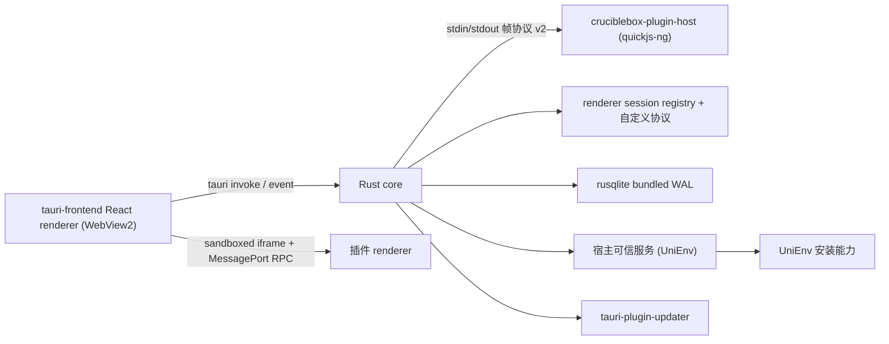

# CrucibleBox 架构（Tauri 2 基线，1.9.1）

> 运行时基线自 1.9.1 起为 **Tauri 2 + Rust core + WebView2 + 插件 Rust sidecar**。
> Electron 43 历史架构（1.5.23 ~ 1.7.3 生产线）已冻结并归档至 `docs/history/` 与
> `docs/electron-legacy-registry.md`（快照 tag `electron-1.7.3-production`）。
> 插件生态契约（Manifest v2 / renderer RPC / backend RPC / 主题 / UniEnv）跨两条线保留。

## 总览



宿主使用 Tauri 2.11.x（Rust）、React 19、Ant Design 6、zustand 与 rusqlite（bundled SQLite）。
WebView2（Chromium）承载宿主 React UI 与插件 sandboxed iframe；Rust core 进程承载 DB、IPC、
会话管理、插件协议与更新。React Server Components 不适用于离线桌面 renderer。

## 进程与信任边界

| 区域                     | 能力                                                   | 信任假设                         |
| ------------------------ | ------------------------------------------------------ | -------------------------------- |
| Rust core                | 窗口、文件、通知、SQLite、会话管理、协议 handler、更新 | 应用信任根                       |
| WebView2 (宿主 renderer) | React UI，无 Node integration，Chromium sandbox        | 宿主代码，不能直接使用 Node/Rust |
| 插件 renderer frame      | 唯一跨源、sandboxed iframe、MessagePort RPC            | 不可信 UI                        |
| 插件 backend sidecar     | quickjs-ng 内的 JS + 帧协议 RPC（无 Node builtin）     | 用户明确确认安装的可信代码       |
| UniEnv 可信服务          | 进程、下载、文件、解压和安装                           | 宿主固定摘要代码                 |

Rust sidecar 是故障隔离，不是恶意 JS 的强制沙箱（quickjs 无 fs/net + 单一管道，隔离仅到
"无 Node 能力"）。普通 backend 必须被用户视为可信代码；高权限 UniEnv 实现不随插件包分发，
而由宿主按版本、文件集合和 SHA-256 策略固定（`shared/trusted-service-policies.json`，
`verify-trusted-services.mjs` 构建期 + `TrustedServiceRuntime` 运行期双 fail-closed）。

**UniEnv 在线版本源（1.9.12+，见 ADR-0021）**：node/go/java 支持从官方端点
（dist/index.json / dl json / Adoptium API）发现新版本并安装，摘要取自上游权威声明并继续
fail-closed 校验。交互为非阻塞：`listVersions` 只回内置目录；在线发现由 renderer 的
「检查语言新版本」按钮经 `checkOnlineVersions` 消息显式触发，宿主侧独立线程 + 8s 硬超时
（覆盖 DNS 解析挂起），失败静默回退内置目录；`onlineVersions` 配置可关闭。

宿主 renderer 使用类型安全页面注册表与 `React.lazy`；默认首页启动闭包、宿主静态入口和全部
renderer JavaScript 分别受独立字节预算约束（`scripts/performance-budgets.json`）。

## 插件安装与生命周期

> 安装事务链（staging / journal / 原子替换 / 崩溃恢复）当前仍是 **Electron 层冻结实现**
> （`plugin-system/PluginInstallationService.ts` 及事务族，见 `docs/electron-legacy-registry.md`
> §二）。Rust 侧等价随 1.9.2 宿主集成落地；本章描述**契约语义**，两线一致。

安装分为不可变准备和提交两段。ZIP/目录先经过普通文件、大小、条目数、路径、symlink、manifest、
SemVer 和权限校验，再创建一次性 stage token。用户确认和最终提交消费同一个快照，避免 TOCTOU。

安装、升级和卸载使用同卷 rename、补偿动作与持久 transaction journal。启动恢复处理 prepared、
applied、committed 各崩溃点；无法无歧义恢复时保留现场并阻止插件激活。每个插件的 activate、
stop、deactivate 和维护操作使用 single-flight/维护租约，配置重启失败会恢复旧配置和旧 runtime。

### 插件排序

插件列表以 `plugins.sort_order` 为稳定排序契约（v3 schema 引入），读取统一按
`sort_order ASC, installed_at DESC`；启用插件的激活顺序跟随列表顺序。重排要求提交全部已安装
插件 ID 的完整排列，重复、缺失与未知 ID 都在写入前被拒绝，新顺序在 `BEGIN IMMEDIATE` 事务内
持久化，失败回滚并保持原列表。新安装插件通过原子 `MAX(sort_order)+1` 追加到列表末尾。

## Renderer 隔离

每次打开插件，Rust core 签发随机 session token、handshake token 与唯一 origin。Tauri 自定义协议
在 Windows 使用 **path 型**形式（`http://cruciblebox-plugin.localhost/<token>/index.html`，
PoC 结论：`scheme://` 形式不被支持）。`src-tauri/src/plugin_session.rs`（session registry：
token/handshakeToken、owner-webview 绑定、TTL、一次性 index 消费）与 `src-tauri/src/plugin_protocol.rs`
（资源路由：index 生成 / runtime.js / renderer.js + MIME 白名单 + 穿越防护）为对等实现。

frame 没有 Electron preload / Node / Rust 访问能力。宿主与 frame 只通过专用 MessagePort 通信
（`src/plugin-runtime/PluginFrameBridge.ts` + `frame-entry.ts`，握手消息
`cruciblebox-plugin-connect/port`）；envelope、方法、结果、事件、requestId、深度、节点、字节和
最多 64 个 pending request 均严格验证（`shared/plugin-renderer-rpc.ts`）。

GIF Editor 的重型残影检测与修复在 frame 内创建一次性 Blob Worker，源码在插件构建时嵌入自包含
renderer，运行时不扩大协议资源白名单。

## Backend SDK（Rust sidecar）

插件 backend 是**纯 JS + 宿主注入 ctx**（零 Node builtin，6 生产插件已核验）。`cruciblebox-plugin-host`
（独立 Rust crate）用 quickjs-ng 在独立进程内加载插件 `dist/main.js`（CJS），注入
`ctx = { id, config, logger, database, storage, api }` 全量方法面，经 `__hostRequest` 与宿主同步往返。

- **帧协议**：stdin/stdout 长度前缀 JSON 帧（4 字节大端，8MB 上限），`frame.rs`。
- **信封 v2**：token/requestId 正则、WORKER_METHODS（4：initialize/dispose/plugin.message/host.event）、
  HOST_METHODS（19：db/storage/log/notification/dialog/network/file/shortcut/event/trusted）、
  payload 预算（256KB/深度 16/数组 512/对象键 256/字符串 64KB），`envelope.rs`。
- **CJS loader**：esbuild 单文件（`module.exports.default`）与 tsc 多文件（`exports.default` + 相对
  require）双流派；路径防逃逸（normalize + plugin 根前缀 + `__cjsLoad` 二次校验）。
- **同步往返模型**：`ctx.with` + job-drain（`execute_pending_job`）解析同步 settle 的 Promise，
  无需 AsyncRuntime/tokio 桥接（1.8.2 PoC 结论）。

旧 manifest 缺 API 版本时按 v1 语义兼容；带 backend 的新插件必须同时声明：

```json
{ "manifestVersion": 2, "backendApiVersion": 2, "rendererApiVersion": 2 }
```

纯 renderer 插件可声明 `"backend": false` 并省略 `backendApiVersion`；宿主仍校验兼容 `main` 入口，
但不会加载它或创建 sidecar 进程。

## 数据层

Rust core 使用 **rusqlite（bundled SQLite 3.53.x）**，与 better-sqlite3 文件格式零迁移兼容。
`src-tauri/src/db.rs` 对等实现：WAL + `foreign_keys=ON` + v1-v3 迁移（`BEGIN IMMEDIATE` 事务内
`user_version`）+ legacy sql.js 插件存储迁移 + 30 天日志清理。schema v3 含 `plugins.sort_order`。

引擎或 migration 失败会回滚、关闭数据库并在窗口创建前终止启动（`show_fatal_error` 用户提示）；
宿主不会以缺表或半迁移状态继续运行。

插件业务数据使用 `ctx.storage`（表主键 `(plugin_id, key)`，单值最多 1 MiB 严格 JSON，
`storage.batch` 原子提交最多 64 个预校验 set/delete）。

## 主题系统

主题以 `ToolboxTheme` 和 `--ob-*` CSS 变量为单一契约，同时映射为 antd tokens。宿主 renderer、
插件 frame 从相同 token 快照更新。ThemeManager 负责内置主题、自定义主题与导入导出；主题变更通过
版本化 renderer RPC 广播。插件只在需要修改主题时申请 `theme:write`。

`shared/themes/presets.ts` 是内置主题单一注册表（静态数据，前端直读，不跨 Rust 边界）。
插件 frame 经 `theme.list` RPC 获取快照、`theme.changed` 事件接收变更。ThemeManager 使用
renderer-safe 语义 CSS 变量原语（`plugins/theme-manager/src/theme-vars.ts`，1.9.0 从 `@openbox/ui`
内联）。宿主侧 theme 命令接线（get/set/list + 广播）随 1.9.2 前端完整迁移落地。

## 可观测性与恢复

- Rust core 启动里程碑记录到 stderr/日志；进程内存探针（`get_process_memory`，P4 A/B 基准）已于 1.9.3 移除。
- 日志与指标：Electron 时代的 JSONL/指标实现冻结中；Rust 侧等价随 1.9.2 落地。
- 插件日志按插件限制 2,000 行并清理 30 天前记录（DB `plugin_logs`）。
- 构建对宿主（tauri-frontend dist）、frame runtime（`out/plugin-frame/runtime.js`）和当前正式插件
  renderer 分别执行体积预算。

## 发布边界

当前正式插件构建为自包含 browser renderer（1.9.0 独立化：插件自包含 `scripts/` 构建器 + 统一 esbuild
0.28.2，宿主只消费 `plugin.json + dist/main.js + dist/renderer.js`）。确定性 ZIP 清单记录版本、
执行模式、API、ZIP 与逐文件 SHA-256；Ed25519 插件签名（canonical JSON，`plugin-artifact-provenance.mjs`）。

- **Tauri 发布链**（`tauri-release.yml`，`tauri-v*` tag）：NSIS 安装器（WebView2 downloadBootstrapper
  兜底）+ tauri-plugin-updater（minisign 强制签名 JSON `latest.json`）+ cargo-cyclonedx Rust SBOM +
  GitHub artifact attestation。首个 Tauri 正式版 = **v1.9.2**。
- **Electron 发布链**（`release.yml`，`v*` tag）：冻结中，归档于 1.9.2。
- 安装器 intentionally unsigned（零证书政策），Windows 声誉警告为明确产品限制。
- macOS、Linux 与 Windows ARM64 不属于当前支持范围。

## Theme v2 与 Manifest 契约

- `shared/themes/presets.ts` 单一内置注册表；宿主拥有持久化与归一化，发布规范 `--ob-color-*`
  变量与迁移别名；隔离插件 frame 经 `theme.list` RPC 获取快照、`theme.changed` 接收变更。
- Manifest v1 仅对已安装插件可读；安装/升级边界拒绝 Legacy Full Trust 包，生态分发仅
  Manifest v2。
