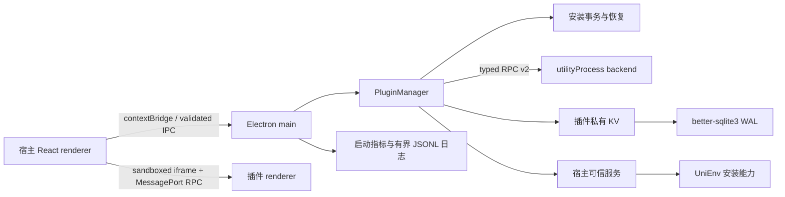

# CrucibleBox 1.5.23 架构

## 总览



宿主使用 Electron 43.3.0、React 19、Ant Design 6、zustand、electron-vite 5 和
electron-builder 26。React Server Components 不适用于离线静态 Electron renderer；宿主采用现代
Client Components、显式 store 与 IPC 边界。

## 进程与信任边界

| 区域                | 能力                                               | 信任假设                    |
| ------------------- | -------------------------------------------------- | --------------------------- |
| Electron main       | 窗口、文件、网络、通知、SQLite、安装事务、可信服务 | 应用信任根                  |
| preload             | 最小 `contextBridge`，只转发已注册 IPC             | 宿主代码                    |
| 宿主 renderer       | React UI，无 Node integration，Chromium sandbox    | 宿主代码，不能直接使用 Node |
| 插件 renderer frame | 唯一跨源、sandboxed iframe、MessagePort RPC        | 不可信 UI                   |
| 普通插件 backend    | utility process 中的 Node API 与 SDK RPC           | 用户明确确认安装的可信代码  |
| UniEnv 可信服务     | 进程、下载、文件、解压和安装                       | 宿主固定摘要代码            |

utility process 是故障隔离，不是恶意 Node 代码的强制沙箱。普通 backend 仍必须被用户视为可信代码；
高权限 UniEnv 实现不随插件包分发，而由宿主按版本、文件集合和 SHA-256 策略固定。

UniEnv 支持的每个工具版本还绑定唯一 Windows x64 文件名、官方 HTTPS URL 与 SHA-256。镜像仅是同一
制品的传输来源，不是信任来源；下载流在写入 `.part` 时增量计算摘要，只有匹配固定目录后才会 fsync
并原子提升。镜像摘要不匹配会清理临时文件并尝试官方源，官方源仍不匹配则安装失败关闭。

可信服务启动时只扫描严格目录表推导出的版本根，并清理其中受命名和真实路径约束的残留
`.unienv-staging-*` 普通目录。已安装 runtime 不参与清理；若恢复检查失败，所有环境写操作 fail-closed，
避免在不明确的崩溃现场继续安装、卸载或切换版本。manifest 的稳定 wire 权限 `trusted:unienv` 即宿主
固定摘要实现的 `environment.manage` 能力，不向第三方 backend 开放。

版本完整性与版本维护状态是两条独立边界。UniEnv 另维护完整类型覆盖的生命周期目录，标注维护分支、
EOL 与无 LTS 的旧版，并记录官方依据日期。UI 将目录首选置顶而非默认最老版本；单项和组合安装均在
启动任务前展示固定旧补丁/EOL 风险。目录仍保留旧版本供遗留项目使用，不把摘要正确误称为安全受支持。

宿主 renderer 使用类型安全页面注册表与 `React.lazy`。工作台、日志、设置和插件详情各自形成 Vite
动态入口；默认首页启动闭包、宿主静态入口和全部 renderer JavaScript 分别受独立字节预算约束。

## 插件安装与生命周期

安装分为不可变准备和提交两段。ZIP/目录先经过普通文件、大小、条目数、路径、symlink、manifest、
SemVer 和权限校验，再创建一次性 stage token。用户确认和最终提交消费同一个快照，避免 TOCTOU。

安装、升级和卸载使用同卷 rename、补偿动作与持久 transaction journal。启动恢复会处理 prepared、
applied、committed 各崩溃点；无法无歧义恢复时保留现场并阻止插件激活。每个插件的 activate、stop、
deactivate 和维护操作使用 single-flight/维护租约，配置重启失败会恢复旧配置和旧 runtime。

应用先创建窗口，再并行恢复已启用插件。启动超时或失败会停止并等待 worker 退出；意外退出会清理
快捷键、订阅和 runtime 引用，插件可以显式重启。

### 插件排序

插件列表以 `plugins.sort_order` 为稳定排序契约，读取统一按 `sort_order ASC, installed_at DESC`；
启用插件的激活顺序跟随列表顺序。重排要求提交全部已安装插件 ID 的完整排列，重复、缺失与未知 ID
都在写入前被拒绝，新顺序在 `BEGIN IMMEDIATE` 事务内持久化，失败回滚并保持原列表。新安装插件
通过原子 `MAX(sort_order)+1` 追加到列表末尾。

排序数据链路：`Home` 页（长按卡片约半秒触发 PointerSensor 拖动，或卡片操作区上移/下移按钮）
→ zustand `plugin.store.reorderPlugins`（乐观更新，失败回滚并恢复原列表）
→ `plugin.api` → preload `IpcChannel.PluginReorder` → main `plugin.ipc.ts`
（`assertTrustedSender` 校验发送方）→ `PluginManager.reorderPlugins`
→ `PluginRepository.reorder`（事务化 `UPDATE plugins SET sort_order = ?`）。

## Renderer 隔离

每次打开插件，主进程签发随机 session token、handshake token 与唯一
`cruciblebox-plugin://<token>.session` origin。index 只能消费一次，资源读取只允许该插件目录内的普通文件，
拒绝穿越、symlink、超限和读取中变化。owner 绑定由主进程 HMAC 证明，不采用 renderer 自报 ID。

frame 没有 Electron preload，不能访问父 DOM、`window.electronAPI`、Node `process` 或 `require`。
宿主与 frame 只通过专用 MessagePort 通信；envelope、方法、结果、事件、requestId、深度、节点、字节和
最多 64 个 pending request 均严格验证。通知、主题写入等在宿主 bridge 再次检查权限。

GIF Editor 的重型残影检测与修复在 frame 内创建一次性 Blob Worker。Worker 源码在插件构建时嵌入自包含 renderer，运行时不扩大协议资源白名单；输入在读取前执行文件预算校验，`ArrayBuffer` 与 RGBA 结果通过 transferable 传递。切换文件、关闭页面或用户停止会立即 terminate Worker 并回收 Blob URL。修复复用检测阶段返回的污染帧号，避免再次执行 O(n²) 分析。

同画布编辑的撤销记录保存可逆 XOR 字节区间，只复制发生变化的帧；结构变化回退到有界全量快照。残影
算法直接处理 RGBA typed arrays，未采用会增加整帧复制的 OffscreenCanvas；只有未来出现能替换现有 CPU
pass 的绘制/缩放工作负载时才启用。

## Backend SDK

backend API v2 使用随机会话 token 和类型化 request/response。worker 只继承 SystemRoot、临时目录、
区域和时区等最小环境，不继承 PATH、HOME 或云凭证。宿主支持日志、通知、对话框、网络、文件、快捷键、
事件、兼容数据库、私有存储和固定可信服务方法。

旧 manifest 缺 API 版本时按 v1 语义兼容；带 backend 的新插件必须同时声明：

```json
{
  "manifestVersion": 2,
  "backendApiVersion": 2,
  "rendererApiVersion": 2
}
```

纯 renderer 插件可声明 `"backend": false` 并省略 `backendApiVersion`。宿主仍校验兼容 `main` 入口，但不会
加载它或创建 utility process；生命周期状态、启停和活跃插件查询保持一致。缺少 `backend` 等价于 `true`，
因此既有插件行为不变。

## 数据层

默认数据库是 better-sqlite3 WAL；sql.js 仅作为显式 A/B fallback。repository 管理设置、插件元数据与
日志。schema 使用 `PRAGMA user_version` 顺序迁移，升级在 `BEGIN IMMEDIATE` 事务中提交。当前
schema v3 增加 `plugins.sort_order`：v2→v3 迁移按既有显示顺序（`installed_at DESC, id ASC`，
旧表回退 `id ASC`）稳定回填，重排后的顺序从迁移前的显示顺序开始，避免迁移改变用户已见到的排列。

引擎或 migration 失败会回滚、关闭数据库并在 PluginManager/窗口创建前终止启动；宿主不会以缺表或
半迁移状态继续运行。Windows packaged smoke 从真实 schema v1 文件验证字节备份、v2/v3 迁移以及
`sort_order` 回填后的列表顺序。

插件业务数据使用 `ctx.storage`。表主键为 `(plugin_id, key)`，插件 RPC 不接受 namespace；单值为最多
1 MiB 的严格 JSON。Diary 和 Turntable 的旧全局表在 schema v2 复制到新格式并保留原表，迁移 marker
保证幂等且防止删除后的数据复活。`storage.batch` 在宿主 `BEGIN IMMEDIATE` 中原子提交最多 64 个已预校验
的 set/delete，插件仍不能选择 namespace 或提交 SQL。Diary 用它原子提交正文并清除恢复草稿。原始 SQL
API 只为旧插件保留，不作为新 SDK 的推荐能力。

Turntable 将整个有序选项列表作为一个私有值提交，backend mutation queue 串行化 read-modify-write，
`storage.batch` 提供提交原子性。中奖样本来自 Web Crypto；renderer 共享纯几何公式，保证后端 winner 的
加权扇区中心最终落在顶部指针，而不是历史实现中的右侧轴线。

## 主题系统

主题以 `ToolboxTheme` 和 `--ob-*` CSS 变量为单一契约，同时映射为 antd tokens。宿主 renderer、插件
frame 和 canvas 工具从相同 token 快照更新。ThemeManager 负责内置主题、自定义主题与导入导出；主题
变更通过版本化 renderer RPC 和 backend event 广播。插件只在需要修改主题时申请 `theme:write`。

## 可观测性与恢复

- 启动里程碑输出 `openbox.startup` schema v1，并记录 Electron working set 与 utility 数量。
- `userData/logs/main.jsonl` 限制为 2 MiB 并保留一个轮转文件。
- session marker 检测上次异常退出；renderer 崩溃恢复每 60 秒最多一次。
- 插件日志按插件限制 2,000 行，并清理 30 天前记录。
- 构建对宿主总量、宿主静态入口、默认首页启动闭包、frame 和六插件 renderer 分别执行体积预算。

## 发布边界

六插件构建为自包含 browser renderer；需要 backend 的插件同时构建 CJS 入口。确定性 ZIP 清单记录版本、
执行模式、API、ZIP 与逐文件 SHA-256。正式 release 要求仓库外 Ed25519 私钥并强制验签，同时生成宿主和
六插件 CycloneDX SBOM。
Windows CI 构建并启动 x64 unpacked 应用；同一个临时 userData 冒烟验证 Electron ABI、SQLite 迁移、
renderer sandbox、跨源插件、utility backend、UniEnv 可信服务和启动/内存预算。macOS、Linux 与 Windows
ARM64 不属于当前支持范围。

## Theme v2

`shared/themes/presets.ts` is the single built-in registry. The host owns persistence and normalization, maps semantic
tokens to Ant Design, and publishes both canonical `--ob-color-*` variables and migration aliases. Isolated plugin
frames obtain registry snapshots through the authenticated `theme.list` RPC and receive live changes through the
existing `theme.changed` event; they never import host state or Electron IPC.

ThemeManager uses the renderer-safe semantic CSS-variable primitives (inlined from `@openbox/ui` into
`plugins/theme-manager/src/theme-vars.ts` in 1.9.0) and host-brokered preview RPC. The frame bridge captures
the original theme, serializes preview operations, clears the rollback point on Keep, and restores it on Undo or frame
disposal. Custom themes are normalized onto a complete mode-specific token set before persistence, so old data remains
readable as the semantic contract grows.

## Desktop updates and release trust

Online updates are an optional adapter. Packaged builds without `resources/app-update.yml` expose a disabled update
state, do not schedule network checks, and retain the complete offline application surface. Release builds configured
for public GitHub Releases use an explicit stable/beta update state machine. Checks may
run in the background, but downloads and installation require user actions. Only an explicit beta-to-stable transition
permits downgrade. The tag workflow emits NSIS metadata and blockmaps, validates installer SHA-512, verifies Electron
fuses, and publishes CycloneDX SBOMs, deterministic SHA-256 checksums and GitHub provenance attestations. Installers are
intentionally unsigned, so Windows reputation warnings remain an explicit product limitation.

Manifest v1 remains readable only for already-installed plugins. Installation and upgrade boundaries reject new
Legacy Full Trust packages; ecosystem distribution is Manifest v2-only.
