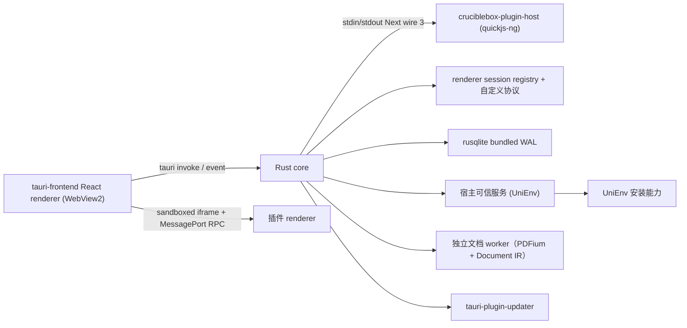

# CrucibleBox 架构（Tauri 2 与冻结的 Next beta.1）

> 当前宿主基线为 2.1.0-beta.4，Tauri 2 + Rust core + WebView2；Next beta.1 已冻结，架构进度与 beta.3 OCR 验收分别记录。
> beta.3 OCR、安装器与正式发布门禁按各自证据追踪；Next 架构成果不表示这些计划已全部完成。
> Electron 43 历史架构（1.5.23 ~ 1.7.3 生产线）已冻结并归档至 `docs/history/` 与
> `docs/electron-legacy-registry.md`（快照 tag `electron-1.7.3-production`）。
> Next 使用冻结的 Manifest/API 5、wire 3；旧 v2-v4 执行运行时已退役，原始数据、旧包与成对回滚仍保留。

## 总览

```mermaid
flowchart LR
  UI["tauri-frontend React renderer (WebView2)"] -->|"tauri invoke / event"| CORE["Rust core"]
  UI -->|"sandboxed iframe + MessagePort RPC"| FRAME["插件 renderer"]
  CORE -->|"stdin/stdout Next wire 3"| SIDECAR["cruciblebox-plugin-host (quickjs-ng)"]
  CORE --> SESSION["renderer session registry + 自定义协议"]
  CORE --> DB["rusqlite bundled WAL"]
  CORE --> TRUSTED["宿主可信服务 (UniEnv)"]
  CORE --> DOCWORKER["独立文档 worker（PDFium + Document IR）"]
  TRUSTED --> UNIENV["UniEnv 安装能力"]
  CORE --> UPDATER["tauri-plugin-updater"]
```

Tauri 宿主使用 Tauri 2.11.x（Rust）、React 18、Ant Design 5、zustand 与 rusqlite（bundled SQLite）；
Electron 冻结线仍保留 React 19 与 Ant Design 6，仅作历史参照。
WebView2（Chromium）承载宿主 React UI 与插件 sandboxed iframe；Rust core 进程承载 DB、IPC、
会话管理、插件协议与更新。React Server Components 不适用于离线桌面 renderer。

## 进程与信任边界

| 区域                     | 能力                                                   | 信任假设                             |
| ------------------------ | ------------------------------------------------------ | ------------------------------------ |
| Rust core                | 窗口、文件、通知、SQLite、会话管理、协议 handler、更新 | 应用信任根                           |
| WebView2 (宿主 renderer) | React UI，无 Node integration，Chromium sandbox        | 宿主代码，不能直接使用 Node/Rust     |
| 插件 renderer frame      | opaque sandboxed iframe、MessagePort RPC               | 不可信 UI                            |
| 插件 backend sidecar     | quickjs-ng 内的 JS + 帧协议 RPC（无 Node builtin）     | 用户明确确认安装的可信代码           |
| UniEnv 可信服务          | 进程、下载、文件、解压和安装                           | 宿主固定摘要代码                     |
| 文档 worker              | PDFium、解析器与 Document IR，仅由独立 worker 进程加载 | 宿主故障隔离，不承诺恶意输入 OS 沙箱 |

Rust sidecar 是故障隔离，不是恶意 JS 的强制沙箱（quickjs 无 fs/net + 单一管道，隔离仅到
"无 Node 能力"）。普通 backend 必须被用户视为可信代码；高权限 UniEnv 实现不随插件包分发，
而由宿主按版本、文件集合和 SHA-256 策略固定（`shared/trusted-service-policies.json`，
`verify-trusted-services.mjs` 构建期 + `TrustedServiceRuntime` 运行期双 fail-closed）。

**UniEnv 在线版本源（1.9.12+，见 ADR-0021）**：node/go/java 支持从官方端点
（dist/index.json / dl json / Adoptium API）发现新版本并安装，摘要取自上游权威声明并继续
fail-closed 校验。交互为非阻塞：`listVersions` 只回内置目录；在线发现由 renderer 的
「检查语言新版本」按钮经 `checkOnlineVersions` 消息显式触发，宿主侧独立线程 + 8s 硬超时
（覆盖 DNS 解析挂起），失败静默回退内置目录；`onlineVersions` 配置可关闭。

宿主 renderer 使用类型安全页面注册表与 `React.lazy`；默认首页启动闭包、宿主静态入口和全部
renderer JavaScript 分别受独立字节预算约束（`scripts/performance-budgets.json`）。

## 插件安装与生命周期

> 当前 Next 安装路径由 Rust 宿主执行 staging、journal、同卷原子替换与启动恢复，源码位于 src-tauri/src/install.rs、transaction.rs 和独立 repository。升级/卸载保留旧目录与用户文件；v2-v4 旧执行入口已退役，历史程序需与原数据库配对回滚。

安装分为不可变准备和提交两段。ZIP/目录先经过普通文件、大小、条目数、路径、symlink、manifest、
SemVer 和权限校验，再创建一次性 stage token。用户确认和最终提交消费同一个快照，避免 TOCTOU。

安装、升级和卸载使用同卷 rename、补偿动作与持久 transaction journal。启动恢复处理 prepared、
applied、committed 各崩溃点；无法无歧义恢复时保留现场并阻止插件激活。每个插件的 activate、
stop、deactivate 和维护操作使用 single-flight/维护租约，配置重启失败会恢复旧配置和旧 runtime。

### 插件排序

插件列表以 `plugins.sort_order` 为稳定排序契约（v3 schema 引入），读取统一按
`sort_order ASC, installed_at DESC`；启用插件的激活顺序跟随列表顺序。普通模式支持单插件长按
排序，批量管理模式支持保持组内相对顺序的多选组拖拽（向下拖到目标项后方，向上拖到目标项
前方）。重排要求提交全部已安装插件 ID 的完整排列，重复、缺失与未知 ID 都在写入前被拒绝，
新顺序在 `BEGIN IMMEDIATE` 事务内持久化，失败回滚并保持原列表。新安装插件通过原子
`MAX(sort_order)+1` 追加到列表末尾。

## Renderer 隔离

每次打开 Next 插件，Rust core 签发会话身份、握手密钥和资源租约，并绑定 owner WebView。tauri-frontend/src/components/NextPluginFrame.tsx 创建不含 allow-same-origin 的 sandboxed iframe，因此插件 origin 为 opaque。src-tauri/src/next_renderer.rs 和 next_frame_runtime.js 提供当前 renderer 会话与握手；plugin_session.rs 管理租约，plugin_protocol.rs 只提供白名单静态资源。

frame 无 Node、Rust 或宿主 DOM 访问能力。宿主与插件通过专用 MessagePort 执行冻结的 Next wire 契约，逐次校验方法、权限、会话期限、requestId、结果与预算。每会话最多 32 个在途请求，JSON 帧上限 64 KiB，未知方法失败关闭。旧 PluginFrameBridge 与 frame-entry 保留用于历史 fixture，不再装配为当前插件执行入口。

GIF 编辑器的残影检测与修复使用插件包内独立 worker，通过冻结的资源接口访问；运行文件与其他 renderer 文件一起纳入固定白名单。

## 退役的 v2-v4 Backend SDK（历史参照）

旧 Manifest/API v2-v4 的执行入口、旧 SQL RPC 与旧 renderer loader 已从当前 Next 宿主运行路径退役。旧安装记录、原始配置和插件存储仍保留用于迁移与诊断，程序回滚必须配对恢复原数据库。Next API 5 若构建 backend，使用独立的 Next executor；其中受限 CJS loader 属于 Next backend 格式支持，不是旧 renderer loader，也不提供 Node 或 SQL 能力。

## 数据层

Rust core 通过独立 repository 使用 rusqlite（bundled SQLite），WAL 与 v1-v10 迁移在 repository 内完成；宿主 db.rs 只适配 repository，不向生产模块公开 SQLite Connection。L3 搬迁前的 WAL checkpoint 也通过 repository API 执行。旧 sql.js 与 v2-v4 插件数据迁移保留原始值；Next schema v10 在卸载与重装事务中保存配置、storage 和迁移标记。

schema v3 的插件排序与早期复制标记是历史迁移来源，不代表当前数据库版本。引擎或迁移失败会回滚、关闭数据库并在窗口创建前终止启动；宿主不会以缺表或半迁移状态继续运行。

## 冻结 Next 协议与数据边界

contracts/next/contract.json 状态为 frozen，是 manifest/API 5、wire 3、data 1 的唯一生成来源。wire JSON 上限 64 KiB、每会话 32 个在途请求；renderer 期限 10 秒，backend.call 单独为 30 秒。存储以准入身份确定命名空间，单值最多 4 MiB、事务最多 8 MiB/32 操作、24 KiB 分块，SQLite 原子提交；读取为会话绑定快照。

独立 `src-tauri/crates/repository` 管理 WAL 和 v1–v10 事务迁移，宿主 `db.rs` 只做适配。v8 增加 Next 暂存表，v9 增加任务投影的执行器版本守卫，v10 按稳定插件 ID 保存卸载配置、存储原值和迁移标记，并在重装事务中恢复；保留旧身份、配置与存储原值。回滚须配对恢复旧程序和旧库。

组合根创建一个 `task-runtime`，通过 `host_services` 和 `platform_service` 显式注入服务、事件端口、可选 worker 和资源。取消先记录意图，执行器停止后确认终态；发布预约拒绝晚到取消，批量发布保留已完成结果引用。文件 I/O 不持任务或主 DB 锁。任务中心投影使用独立执行器版本守卫拒绝迟到事件和 renderer 修改，启动后重放核心快照。

文件发布采用独立 WAL 日志及摘要收据；PDF、归档、环境安装与导出适配器通过统一 runtime 发布结果。批量结果按输出目录记录有界引用。升级及卸载保留旧插件目录与空目录，不自动清理用户文件。`scripts/next-paired-rollback.mjs` 保存并验证旧程序与一致性数据库配对，只向新目录恢复。

七个官方 Next 插件为文档与知识库、主题管理、开发环境管理、日记与笔记、随机决策、GIF 动画编辑、压缩与解压缩。使用 Manifest/API 5、wire 3，自包含 SDK/CLI，renderer-only；GIF 包另含 worker。其余旧插件包和用户数据保留。独立构建从根锁文件导出精确依赖，并验证重复 ZIP 和运行文件一致性。Next CLI 使用 esbuild 0.25.12；旧插件构建器继续保留其原版本。

基础宿主无需文档 worker 即可启动；PDFium 与 document-worker.exe 作为独立校验包按需安装，catalog 摘要由同一目标构建在 CI/发布前生成。OCR worker、模型和公式能力另有资源门禁；文档架构改动不代表 OCR 精度提高或 beta.3 全计划完成。

## 主题系统

主题以 `ToolboxTheme` 和 `--ob-*` CSS 变量为单一契约，同时映射为 antd tokens。宿主 renderer、
插件 frame 从相同 token 快照更新。ThemeManager 负责内置主题、自定义主题与导入导出；主题变更通过
版本化 renderer RPC 广播。插件只在需要修改主题时申请 `theme:write`。

`shared/themes/presets.ts` 是内置主题单一注册表（静态数据，前端直读，不跨 Rust 边界）。
插件 frame 经 `theme.list` RPC 获取快照、`theme.changed` 事件接收变更。ThemeManager 使用
renderer-safe 语义 CSS 变量原语（`plugins/theme-manager/src/theme-vars.ts`，1.9.0 从 `@openbox/ui`
内联）。宿主通过 theme API 提供读取、更新和变化通知；插件按需声明 theme:write。

## 可观测性与恢复

- Rust core 启动里程碑记录到 stderr/日志；进程内存探针（`get_process_memory`，P4 A/B 基准）已于 1.9.3 移除。
- Rust 生产线按任务和插件故障定位记录必要信息；历史 Electron 日志实现不属于活动运行时。
- 插件日志按插件限制 2,000 行并清理 30 天前记录（DB `plugin_logs`）。
- 构建对宿主（tauri-frontend dist）、frame runtime（`out/plugin-frame/runtime.js`）和当前正式插件
  renderer 分别执行体积预算。

## 发布边界

七官方 Next 插件由独立 CLI 构建，宿主消费 Manifest v5 和声明的 renderer/worker 文件。确定性 ZIP 清单记录版本、执行模式、API、ZIP 与逐文件 SHA-256；Ed25519 签名和供应链校验沿用现有发布机制。

- **Tauri 发布链**（`tauri-release.yml`，`tauri-v*` tag）：NSIS 安装器（WebView2 downloadBootstrapper
  兜底）+ tauri-plugin-updater（minisign 强制签名 JSON `latest.json`）+ cargo-cyclonedx Rust SBOM +
  GitHub artifact attestation。首个 Tauri 正式版 = **v1.9.2**。
- **Electron 发布链**（`release.yml`，`v*` tag）：冻结中，归档于 1.9.2。
- 安装器 intentionally unsigned（零证书政策），Windows 声誉警告为明确产品限制。
- macOS、Linux 与 Windows ARM64 不属于当前支持范围。

## Theme v2 与 Manifest 契约

- `shared/themes/presets.ts` 单一内置注册表；宿主拥有持久化与归一化，发布规范 `--ob-color-*`
  变量与迁移别名；隔离插件 frame 经 `theme.list` RPC 获取快照、`theme.changed` 接收变更。
- 安装和运行只接受 Next Manifest v5；旧包与数据保留，旧运行时已退出。七个官方插件通过发布目录提供升级。
