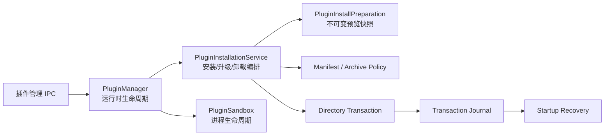

# 插件平台 M2.1：生命周期与可恢复事务

- 状态：已完成
- 日期：2026-08-09
- 兼容目标：现有插件 manifest、配置和用户数据不迁移

## 本轮目标

M2.1 修复宿主插件生命周期和安装维护路径中的确定性故障：并发重复启动、启动超时残留
子进程、崩溃后无法重启、插件阻塞首窗、升级先删旧版本、卸载失败留下孤儿，以及确认
安装内容与实际安装内容不一致。本轮不把现有 Node 子进程称为安全沙箱；renderer 隔离和
backend 强制能力边界分别属于 M2.2、M2.3。

## 模块边界



- `PluginManager` 只保留 runtime、消息、权限上下文、配置重启和状态事件。
- 安装服务持有同名安装 single-flight、维护租约、目录/数据库补偿事务和恢复阻断状态。
- 安装准备层把 ZIP 或目录复制为宿主管理的不可变 stage，并返回只在主进程内使用的
  opaque token。用户确认后提交同一个快照，不重新读取原路径。
- manifest、ZIP、目录复制和 journal 各自有独立策略模块及纯文件系统测试。

## 生命周期保证

- 同一插件并发或重入激活共享一个 Promise，只创建一个 runtime。
- runtime 在启动完成前就被跟踪；超时、启动失败和取消都会终止子进程并等待退出。
- 正常停止与意外崩溃分流。崩溃会释放快捷键、事件订阅和引用，随后允许显式重启。
- stop 与 activate 的竞态有确定顺序；停用完成后不会出现“已停用但进程又回来”。
- 所有已启用插件并行恢复，并在首个 BrowserWindow 创建后后台执行，不阻塞首窗。
- 升级、卸载和配置变更共用每插件维护租约；冲突请求失败关闭。

## 安装事务与崩溃恢复

安装候选必须是普通目录或受预算约束的 ZIP。宿主拒绝路径穿越、大小写碰撞、重复条目、
符号链接、特殊文件、未知权限、非规范入口、无效 SemVer、超过 5,000 个文件或 600 MiB
的目录，以及超过 200 MiB 的压缩包。manifest 上限为 256 KiB，并通过文件描述符前后
一致性检查抵御读取期间替换。

事务阶段如下：

```text
prepared journal
  → same-volume stage/swap 或 quarantine
  → applied journal
  → SQLite 元数据更新
  → 已启用插件健康启动
  → committed journal
  → backup/quarantine 与 journal 清理
```

启动时恢复器只扫描插件目录的直属普通目录，不跟随符号链接。它根据 operation、phase、
目录形态和宿主元数据执行幂等恢复；任何无唯一安全答案的状态都会保留现场并把插件加入
阻断集合。被阻断插件不能激活、升级、卸载或改配置，避免错误的自动修复扩大损失。

## 配置和数据兼容性

- 升级不写 `config_data`，旧配置保持原样。
- 配置更新会先保存旧值和 runtime 状态；新配置重启失败时恢复旧配置和旧 runtime。
- 禁用插件升级后保持禁用；已开始的用户停用优先于随后到达的升级。
- 没有数据 schema 迁移，不删除无元数据的普通插件目录。
- 补偿事务覆盖代码目录、manifest、宿主插件元数据和宿主管理配置，不覆盖插件在
  `activate()` 内直接修改的自建表或任意文件。SDK v2 会提供显式、版本化 migration。
- journal 面向进程崩溃恢复；不宣称 SQLite 与文件系统之间具备断电级跨介质 ACID。

## 构建、测试与运行

完整验收命令：

```powershell
npm run check
npm run build
npm run package:dir
npm run smoke:packaged
```

定向测试覆盖 manifest/ZIP/目录策略、install/upgrade/uninstall 成功与补偿、不可变确认
快照、并发安装、停用竞态、配置回滚、生命周期 single-flight、超时回收、崩溃重启，
以及 install/upgrade/uninstall 各崩溃窗口的重复恢复。

最终验收结果：

- 宿主 12 个测试文件、103 项测试全部通过，其中安装/停用/配置竞态测试 12/12。
- GIF Editor 4 个测试文件、35 项测试以及 UniEnv 9 个测试文件、116 项测试全部通过；
  六个插件均通过类型检查和 clean production build。
- 根工程 Prettier、ESLint、Node/renderer/test/plugin/script 类型检查全部通过。
- Electron 主进程、preload 和 renderer 生产构建通过；Windows x64 unpacked 目录打包完成。
- packaged 应用隐藏窗口冒烟通过，确认数据库初始化和 renderer 加载成功。

## 明确延后

- 同步 ZIP 解压和大目录 stage 仍可能阻塞 Electron 主线程；后续迁入受控 utility
  process/worker，并保留同一事务协议。
- 发布包尚未实施签名、证书信任链、SBOM 和来源策略；供应链治理进入后续里程碑。
- 当前 backend 是完整 Node 进程，manifest 权限只描述经宿主 API 的能力，不能约束插件
  直接调用 Node API。M2.3 将把 UniEnv 安装能力下沉到宿主持有的受信服务。
- renderer 仍与宿主页同 document 执行，真正的跨源 iframe/MessagePort 隔离属于 M2.2。
