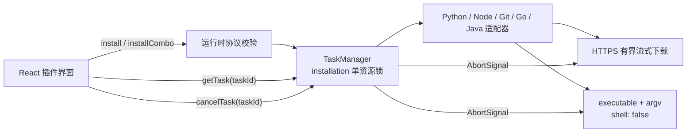

# UniEnv M1.2：受控安装任务与无 Shell 执行

- 状态：已完成
- 日期：2026-08-09
- 插件版本：0.4.0

## 本轮目标

消除 UniEnv 已确认的字符串 Shell 注入面、30 秒宿主 RPC 与长安装任务不兼容、输入与
安装路径未校验、组合安装不可取消、下载无资源边界及失败残留等问题。保持现有 Windows
工具版本目录和 `current` junction 模型，不删除或迁移用户已有运行时。

## 任务与执行边界



`install` 和 `installCombo` 只创建后台任务并立即返回 `taskId`。界面每秒查询任务快照，
最长等待 90 分钟，可显示 `queued/running/succeeded/failed/cancelled`、进度及结构化错误。
取消信号贯穿下载、解压和安装器子进程；组件卸载会终止轮询并清理定时器，不再向已卸载
组件写状态。

所有安装和组合安装共享 `installation` 资源锁；卸载、版本切换与后台安装也互斥。取消
后任务立即进入终态，但资源锁会保留到实际执行器退出，避免旧安装器尚未结束时启动下一
个写操作。后端只返回脱敏错误，不向渲染进程暴露内部堆栈或本机源码路径。

## 类型安全协议与输入校验

- 所有消息先解析为判别联合；拒绝 null、非普通对象、未知类型/字段、控制字符和超长
  token。旧 `getProgress {tool}` 已删除。
- 工具与版本使用单一 `SUPPORTED_TOOL_VERSIONS` 目录；安装、切换及自定义组合均拒绝
  未维护版本或跨工具版本。
- 下载镜像只接受 manifest 中的 `direct/huawei/aliyun/tuna`。
- 自定义组合 JSON 上限 64 KiB、20 个组合、每组 10 个工具；拒绝重复 ID/工具、覆盖
  内置组合、prototype pollution 键及未知字段。旧配置缺少 `description` 时兼容为
  空字符串。
- 安装根目录只接受 Windows 盘符绝对路径，规范化盘符、分隔符、`.` 和尾分隔符；
  拒绝盘符根目录、相对路径、`..`、UNC、设备 namespace、控制字符、保留设备名、
  尾点/尾空格及不安全路径段。规范路径和版本目标均受 240 字符上限约束。
- 非 Windows 平台对检测和所有系统写操作失败关闭；工具/版本/组合元数据仍可读取。

## 进程、下载与文件安全

- 12 处字符串命令全部迁为独立 executable 与 argv，Node `spawn` 固定 `shell:false`、
  隐藏窗口；拒绝 NUL/换行参数。
- 默认进程超时 30 秒，安装器显式 600 秒；stdout/stderr 各限制 1 MiB。失败使用结构化
  `ProcessExecutionError`。
- Windows 取消/超时会等待 `taskkill /T /F`；2 秒内无法完成则回退直接硬终止，任务
  不会在终止动作提交前释放资源锁。
- 下载只允许无凭据 HTTPS，重定向后的最终 URL 也必须是 HTTPS；Content-Length 与
  实际累计内容均限制为 512 MiB，每次 body read 的空闲上限为 30 秒。
- 下载流写入同目录 `.part`，完成 `fsync` 后原子 rename；失败、超限和取消均清理
  部分文件。
- PowerShell 解压脚本是固定常量，动态路径只通过环境变量和 `LiteralPath` 传入。
- ZIP 工具在版本目录内创建唯一 `mkdtemp` staging，解压完成后同卷原子提升 runtime；
  已存在 runtime 时拒绝覆盖。Python/Git 直接安装器也只接受空目标目录，已有文件时拒绝
  继续。清理函数会验证 staging 的真实父目录、前缀及非符号链接，不递归删除普通目录
  或边界外路径。
- junction 使用文件系统 API 创建和移除；若 `current` 是普通目录则拒绝删除。

manifest 现按实际行为声明 `shell:exec`、`network:fetch`、`file:read`、`file:write`，移除
未使用的 notification/dialog。当前宿主权限仍不是完整安全边界，真正的能力隔离属于 M2。

## 兼容性与用户数据

- 0.4.0 的任务消息是宿主与同一插件包内 renderer 的同步升级，不修改宿主数据库或
  UniEnv 配置 schema。
- 旧安装根目录、镜像和自定义组合配置继续读取；默认值保持 `C:\\UniEnv`、`direct`、
  `[]`。
- 本轮不会删除任何版本目录。卸载只移除受验证的 `current` junction；ZIP 安装不会
  覆盖已存在 runtime，Python/Git 不会写入非空版本目录。无数据迁移，也没有运行真实
  安装器。

## 测试与验收

UniEnv 是独立 Vitest 项目，`npm run check` 会执行 typecheck、116 项测试和 clean build。
9 个测试文件覆盖：

- 严格消息/config/custom combo 解析及所有长度、字段、版本边界；
- Windows 路径规范化、namespace/traversal/保留名及目标 containment；
- TaskManager 状态机、资源互斥、取消竞态、进度、错误序列化和有界保留；
- executable/argv、`shell:false`、超时/取消、输出上限及等待进程树终止；
- HTTPS、响应/累计字节上限、body idle timeout、`.part` 原子写与清理；
- staging 原子提升、拒绝覆盖和边界外递归删除保护；
- 后端 taskId 集成、组合部分失败、堆栈脱敏、非 Windows 失败关闭；
- renderer 响应守卫、进度终态、取消 delay/in-flight 请求及轮询 deadline。

整仓验收结果：

```powershell
npm run check
npm run build
npm run package:plugins
npm run verify:plugins
npm run package:dir
npm run smoke:packaged
```

宿主 40 项、GIF Editor 35 项、UniEnv 116 项测试全部通过。两次插件打包哈希一致，
unpacked Electron 应用已在隐藏窗口下完成数据库与 renderer 初始化。

最终制品：`artifacts/plugins/unienv-0.4.0.zip`

```text
SHA-256 95c14fced9a603d1ceadb08e5159c1443632c7b969e4469f69d41aea3289f04c
```

## 明确延后

- 下载产物尚无 SHA-256/发布者签名校验，也未建立下载主机 allowlist；HTTPS 不能抵御
  合法镜像或上游被攻破。这是下一轮供应链治理的阻断项。
- 解压后尚无文件数量、总解压字节和逐条目路径的二次审计，仍需 ZIP bomb/路径边界
  防护。
- 空闲超时不能阻止低速滴流；仍需总下载期限或最低吞吐率。
- 当前测试使用 fake spawn/fetch 与临时目录。真实 Windows VM 的安装、取消、切换与回滚 E2E 已在
  一次性 Windows VM 中完成并通过（1.5.23 基线，用户确认范围）；UniEnv 当前版本为 0.5.7，制品
  白名单与 SHA-256 见 `artifacts/plugins/manifest.json`。
- renderer 重载后尚不能发现后端仍在运行的任务；任务持久化/恢复与宿主插件进程崩溃
  恢复一并进入后续可靠性里程碑。
- 插件仍运行在完整 Node 子进程中；manifest 权限目前只能描述意图，不能阻止插件绕过
  宿主 API。M2 必须落地真正的插件能力边界。
